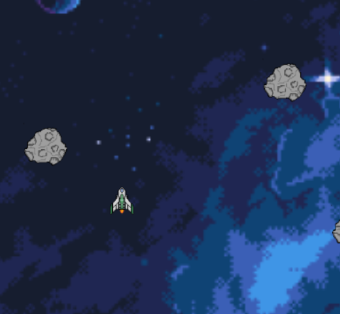

# SpaceRiders Game

SpaceRiders is a really simple browser-based game where you navigate a spaceship through a field of meteorites, collecting points and using boost to enhance your speed.
This game was made to pass by time and clean up some rusty JavaScript skills.

## Features

- Dynamic generation of meteorites to add a challenge.
- Boost feature to enhance your speed and maneuverability.
- Score tracking to compete with friends.

## How to Play

1. **Starting the Game**:
   - Press the **Enter** key to start the game.

2. **Controls**:
   - Use the arrow keys (Up, Down, Left, Right) to control the spaceship.
   - Press the **Space** key to activate boost and increase speed.

3. **Gameplay**:
   - Navigate your spaceship through the field of meteorites.
   - Avoid colliding with meteorites to stay alive.
   - Collect points as you navigate through the field.
   - Use boost strategically to evade obstacles and collect points faster.

4. **Ending the Game**:
   - The game ends when the spaceship collides with a meteorite.
   - Press the **Enter** key to restart the game after it ends.

## Screenshots

## Installation

SpaceRiders is a browser-based game and does not require any installation. Simply open the provided HTML file in a modern web browser to start playing.

